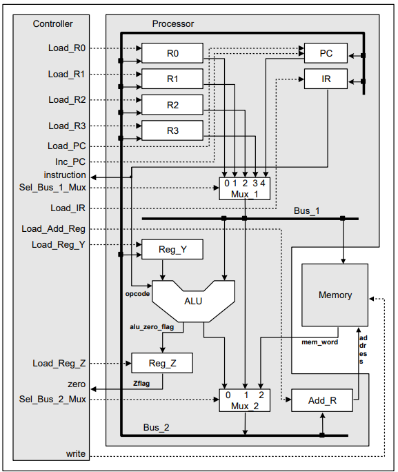
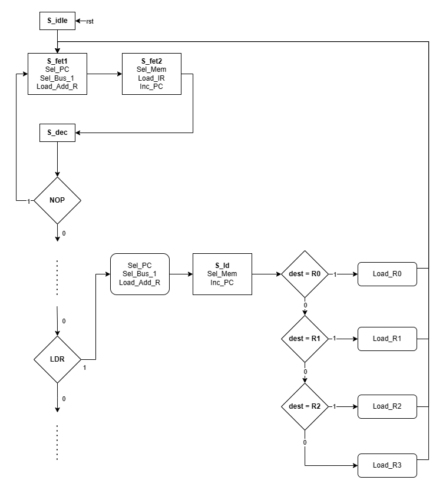

### RISC Stored-Program Machine (RISC SPM)

#### Overview

This project implements an extended version of a Reduced Instruction Set Computer (RISC) Stored-Program Machine (SPM) as originally detailed in "Advanced Digital Design with the Verilog HDL" by Michael D. Ciletti. This enhanced version includes modifications such as an additional instruction **(LDR)**, enhancing the capability and flexibility of the machine.

#### Reference
For complete details on the design and synthesis, please refer to **Chapter 7, Section 3** of the book *Advanced Digital Design with the Verilog HDL by Michael D. Ciletti*.

#### Architecture

The RISC SPM consists of three main units:
1. **Processor**: Handles arithmetic and logic operations via its Arithmetic Logic Unit (ALU).
2. **Controller**: Manages the flow of data and instructions across the system.
3. **Memory**: Stores instructions and data.

Key components include:
- General-purpose registers (R0 to R3)
- Program counter (PC)
- Instruction register (IR)
- Multiplexers and buses for data routing

#### Instruction Set

The machine supports a basic set of instructions necessary for operations such as data movement, arithmetic operations, and control flow. These include:
- **NOP**: No operation
- **ADD, SUB, AND, NOT**: Standard arithmetic and logical operations
- **RD, WR**: Memory read/write operations
- **BR, BRZ**: Branch and branch-if-zero for control flow

Instructions can be of two types:

- Single-byte instructions for simple operations
- Two-byte instructions for operations involving memory access or branching

#### Extended Instruction Set

With the addition of the LDR instruction to enhance memory handling capabilities.

- **LDR**: Load register directly from a memory address

#### State Machine

The control unit operates as a finite state machine (FSM) with specified states for various phases of instruction execution:
1. **Fetch**: Load the next instruction from memory.
2. **Decode**: Determine the operation and involved registers.
3. **Execute**: Perform the operation defined by the instruction.

#### Implementation Notes

1. **Verilog HDL**: The entire system is modeled in Verilog HDL.
2. **Testing and Simulation**: Extensive tests are performed to ensure all parts of the system work correctly together, including edge cases for instruction execution.

#### Usage

To utilize this RISC SPM design for educational or project purposes, follow these steps:
1. **Setup**: Clone the repository containing the Verilog files.
2. **Simulation**: Use a Verilog-compatible simulator to load and run the test benches.
3. **Modifications**: Modify the designs as per project requirements, and re-simulate to ensure functionality.

#### Testing RISC SPM

The testing of the RISC SPM involves:

1. **Clear the Memory**: Initially clear all memory locations to prevent any residual data from affecting the tests.
2. **Load Memory with a Simple Program and Data**: Populate the memory with a basic program that will execute a predefined set of operations, along with necessary data.
3. **Execute the Simple Program**: Run the loaded program to perform the following operations:
   - Read values from memory into registers.
   - Perform arithmetic operations such as subtraction to decrement a loop counter.
   - Accumulate values in a register during the loop execution.
   - Branch to a halt when the loop index reaches zero.
4. **Probe Memory Locations and Control Signals**: After the execution, inspect specific memory locations and control signals to verify that the machine has performed as expected.

#### NOTE

This documentation is a foundational guide for anyone looking to implement or understand the RISC SPM as described by Michael D. Ciletti. For a deeper dive into the architectural choices and detailed design decisions, the referenced book chapter provides comprehensive insights and theoretical underpinnings.

